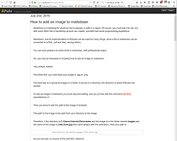

---

## risyphus and R Markdown
rispyphus was perceived as helper functions for recurrent needs when compiling
analysis reports in R Markdown. Thus, rispyphus is intended to be used
within Rmd-scripts (R-Markdown). This vignette describes details of how
to integrate risyphus functionality with R Markdown.

## Why R Markdown?


=== continue here ===

>This is a test document only. Content will be added soon.

## Outline

This simple example will show:

* how to use a function in risyphus.

* how to get the risyphus functionality into html-output using R Markdown.


## Test image

## Test image: Works for vignettes (image in subfolder of Rmd-file folder)

Here we add an image: 





## Using a function for knitr directly: Works for vignettes

```{r }

knitr::include_graphics(path = 'Vignettes_images/test_link_image.png', dpi = 200)


```

Using a function for knitr directly:

```{r out.height=300, out.width=300}

knitr::include_graphics(path = 'Vignettes_images/test_link_image.png')

```


Or like this?

```{r out.width="50%"}

knitr::include_graphics(path = 'Vignettes_images/test_link_image.png')


```


## Used packages

List packages


*****

End of document

*****
